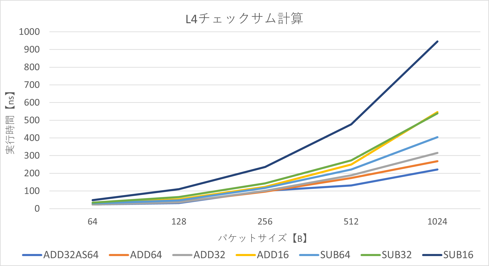
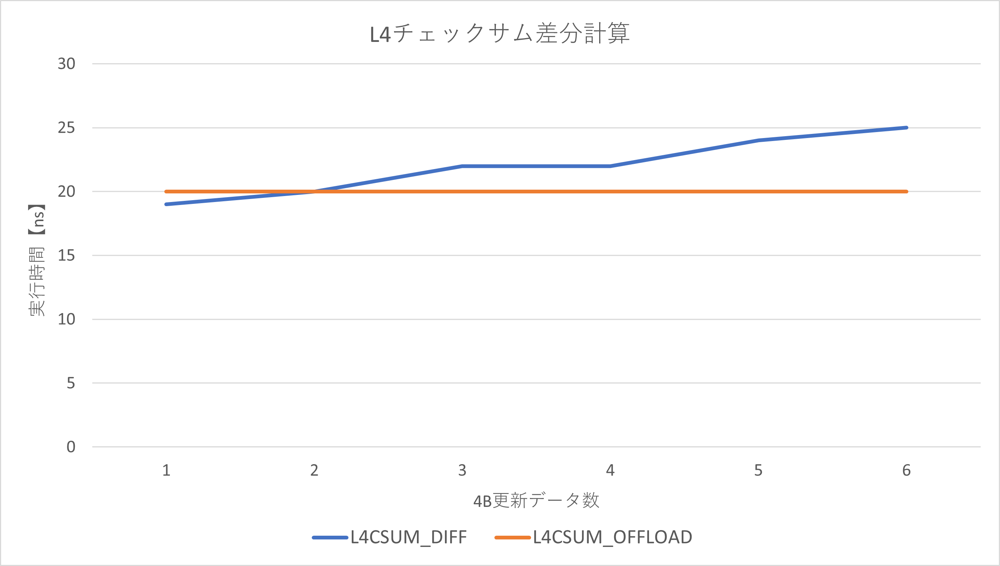

## L4チェックサム計算プロキシ

L4チェックサム計算を複数の手法で計算するDPDKプロキシ

Rx ポート0 -> calculate l4 checksum -> Tx ポート1

### 計算方法

- ADD32AS64
    - 32bitの1の補数和を64bit符号なし整数に格納

- ADD64
    - 64bitの1の補数和を64bit符号なし整数に格納

- ADD32
    - 32bitの1の補数和を32bit符号なし整数に格納

- ADD16
    - 16bitの1の補数和を16bit符号なし整数に格納

- SUB64
    - 64bitの1の補数和を減算で求め64bit符号なし整数に格納

- SUB32
    - 32bitの1の補数和を減算で求め32bit符号なし整数に格納

- SUB16
    - 16bitの1の補数和を減算で求め16bit符号なし整数に格納

ADD16AS32は，オーバーフローの検知に16bit確保しているが，最大で255回の検知できず，パケット長16bit * 256 = 512B以下のみ対応するため不採用．

SUBXXは，加算処理を減算に置き換えたもので，オーバーフローの折返し処理にデータ依存がないため比較に採用．

- L4CSUM_DIFF
    - ADD32ベースのチェックサム差分計算

- L4CSUM_OFFLOAD
    - L4チェックサムのH/Wオフロード，疑似ヘッダの計算

### 実行結果

pktgenでポート0にパケット送信，ポート1から送信したパケットの受け取り側でチェックサムの正誤を確認．

